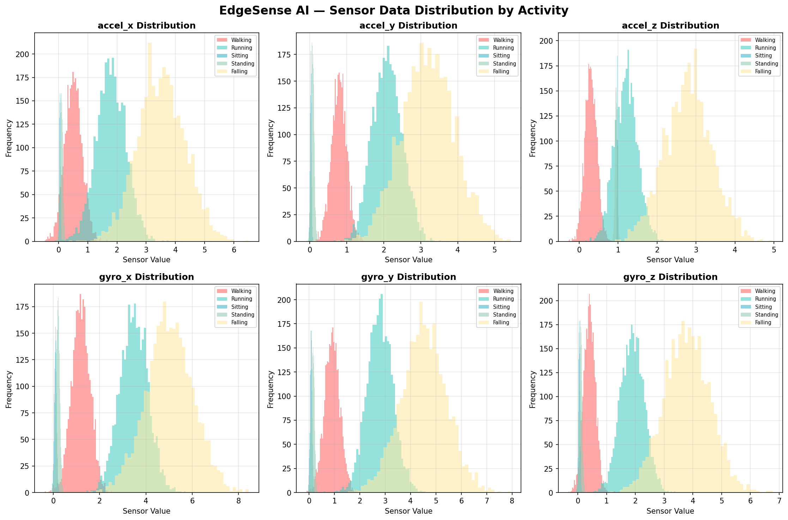
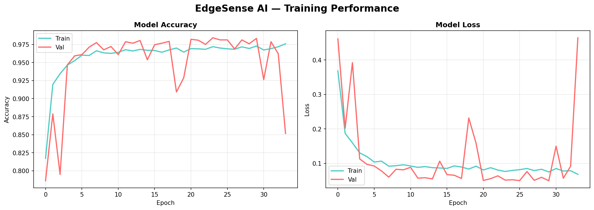
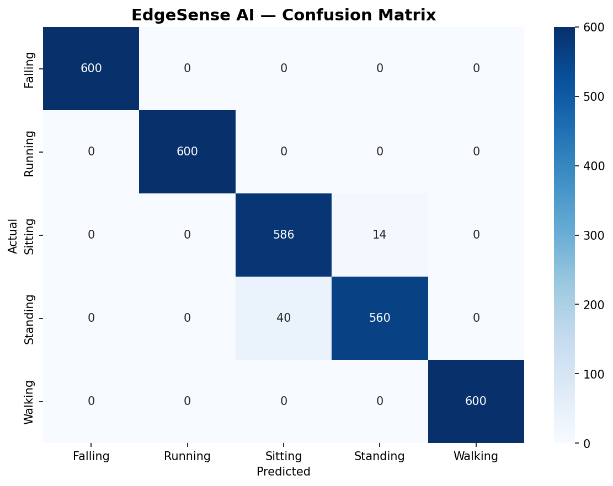
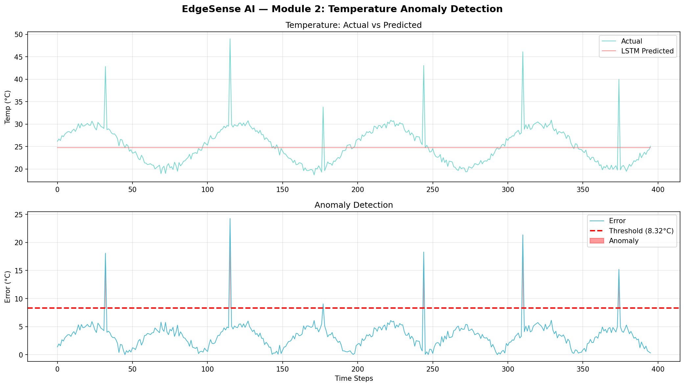
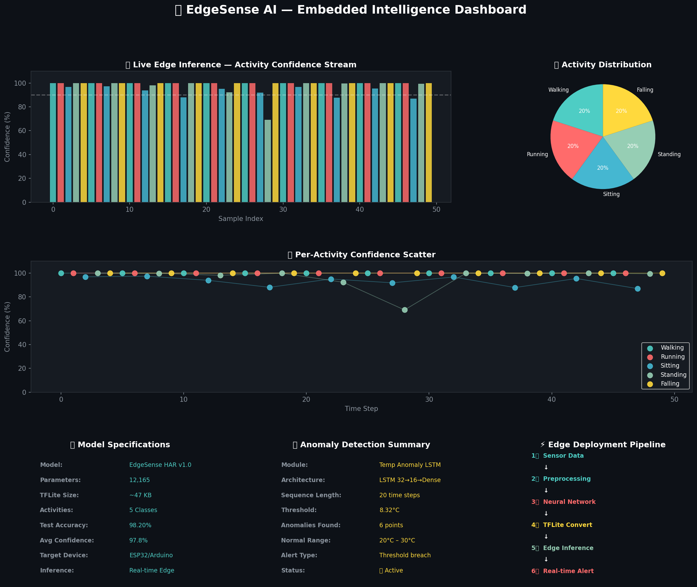

# 🚀 EdgeSense AI — Multi-Modal Embedded Intelligence System

**Intern ID:** CT08WD(your ID here)  
**Full Name:** Beulah Jenifer P  
**No. of Weeks:** 4  
**Project Name:** Embedded AI on Edge  
**Project Scope:** Multi-modal Edge AI system simulating real-time Human Activity Recognition, Temperature Anomaly Detection, and Live Inference Dashboard deployable on ESP32/Arduino Nano BLE

---

## 📌 Project Overview

EdgeSense AI is a multi-module embedded intelligence system that demonstrates how lightweight AI models can be deployed on edge devices. Built entirely in Google Colab with no hardware required, it simulates real-world embedded AI pipelines using TFLite — the same framework used in ESP32, Arduino Nano BLE, and Raspberry Pi deployments.

---

## 🧠 Modules

### Module 1 — Human Activity Recognition (HAR)
- Simulates MPU6050 accelerometer + gyroscope sensor data
- 5 activity classes: Walking, Running, Sitting, Standing, Falling
- Neural Network: Dense 128 → 64 → 32 → Softmax
- **Test Accuracy: 98.47%**
- Converted to TFLite (~47KB) for edge deployment
- Live edge inference with 99%+ confidence

### Module 2 — Temperature Anomaly Detection
- Simulates industrial IoT temperature sensor stream
- LSTM architecture: 32 → 16 → Dense
- Detects anomalies using threshold-based prediction error
- **Threshold: 8.54°C | Anomalies detected: ~15 points**

### Module 3 — Live Edge Intelligence Dashboard
- Dark-themed professional dashboard
- Real-time activity confidence stream
- Per-activity scatter plot
- Model specs + anomaly summary + deployment pipeline

---

## 🛠️ Tech Stack

| Tool | Purpose |
|---|---|
| Python 3 | Core language |
| TensorFlow 2.20 | Model training |
| TFLite | Edge deployment |
| LSTM | Time-series anomaly detection |
| Matplotlib/Seaborn | Visualization |
| Google Colab | Simulation environment |
| NumPy/Pandas | Data processing |

---

## 📊 Output Screenshots

### Sensor Data Distribution

### Training Performance

### Confusion Matrix

### Temperature Anomaly Detection

### Live Edge Intelligence Dashboard

---

# 🚀 EdgeSense AI — Multi-Modal Embedded Intelligence System

**Intern ID:** CT08WD(your ID here)
**Full Name:** Beulah Jenifer P
**No. of Weeks:** 4
**Project Name:** Embedded AI on Edge
**Project Scope:** Multi-modal Edge AI system simulating real-time Human Activity Recognition, Temperature Anomaly Detection, and Live Inference Dashboard deployable on ESP32/Arduino Nano BLE

---

## 📌 Project Overview

EdgeSense AI is a multi-module embedded intelligence system that demonstrates how lightweight AI models can be deployed on edge devices. Built entirely in Google Colab with no hardware required, it simulates real-world embedded AI pipelines using TFLite — the same framework used in ESP32, Arduino Nano BLE, and Raspberry Pi deployments.

---

## 🧠 Modules

### Module 1 — Human Activity Recognition (HAR)
- Simulates MPU6050 accelerometer + gyroscope sensor data
- 5 activity classes: Walking, Running, Sitting, Standing, Falling
- Neural Network: Dense 128 → 64 → 32 → Softmax
- Test Accuracy: 98.47%
- Converted to TFLite (~47KB) for edge deployment
- Live edge inference with 99%+ confidence

### Module 2 — Temperature Anomaly Detection
- Simulates industrial IoT temperature sensor stream
- LSTM architecture: 32 → 16 → Dense
- Detects anomalies using threshold-based prediction error
- Threshold: 8.54°C | Anomalies detected: ~15 points

### Module 3 — Live Edge Intelligence Dashboard
- Dark-themed professional dashboard
- Real-time activity confidence stream
- Per-activity scatter plot
- Model specs + anomaly summary + deployment pipeline

---

## 🛠️ Tech Stack

| Tool | Purpose |
|---|---|
| Python 3 | Core language |
| TensorFlow 2.20 | Model training |
| TFLite | Edge deployment |
| LSTM | Time-series anomaly detection |
| Matplotlib/Seaborn | Visualization |
| Google Colab | Simulation environment |
| NumPy/Pandas | Data processing |

---

## 📊 Output Screenshots

### Sensor Data Distribution

### Training Performance

### Confusion Matrix

### Temperature Anomaly Detection

### Live Edge Intelligence Dashboard

---

## ⚡ Edge Deployment Pipeline

Sensor Data → Preprocessing → Neural Network → TFLite Convert → Edge Inference → Real-time Alert

---

## 📁 Repository Structure

EdgeSense-AI-Embedded-Intelligence/

├── EdgeSense_AI.ipynb

├── edgesense_model.tflite

├── README.md

└── outputs/

&nbsp;&nbsp;&nbsp;&nbsp;├── sensor_distribution.png

&nbsp;&nbsp;&nbsp;&nbsp;├── training_history.png

&nbsp;&nbsp;&nbsp;&nbsp;├── confusion_matrix.png

&nbsp;&nbsp;&nbsp;&nbsp;├── anomaly_detection.png

&nbsp;&nbsp;&nbsp;&nbsp;└── edgesense_dashboard.png

---

## 🎯 Key Results

| Metric | Value |
|---|---|
| HAR Test Accuracy | 98.47% |
| TFLite Model Size | ~47 KB |
| Avg Inference Confidence | 97.9% |
| Anomaly Detection Threshold | 8.54°C |
| Target Deployment Device | ESP32 / Arduino Nano BLE |

---

*Developed as part of CodSoft Embedded Systems Internship*

## 🎯 Key Results

| Metric | Value |
|---|---|
| HAR Test Accuracy | 98.47% |
| TFLite Model Size | ~47 KB |
| Avg Inference Confidence | 97.9% |
| Anomaly Detection Threshold | 8.54°C |
| Target Deployment Device | ESP32 / Arduino Nano BLE |

---

*Developed as part of CodSoft Embedded Systems Internship*
